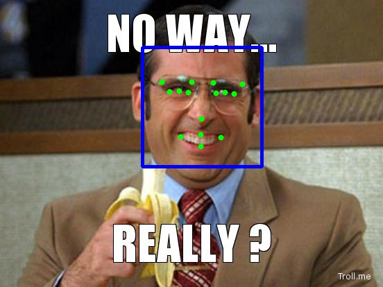

# Facial KeyPoints Detection and Real Time Face Filtering
## Overview

A demo project for facial keypoint detection and a real time sunglasses filter built with the amalgamation of latest computer vision techniques and deep learning. It detects a total of 15 facial keypoints around eyes, eyebrows, nose and mouth. Facial keypoint detection is widely used in applications of facial recognition, emotion artificial intelligence, and in the fun social media applications like SnapChat and Instagram. The dataset used in this project is included in `data` folder and was obtained from [this kaggle competition.](https://www.kaggle.com/c/facial-keypoints-detection/data)

## Dependencies

* keras
* tensorflow
* opencv

I have tested and successfully executed the code in python3.6. Before training the model again or experimenting with it make sure you have **unzipped** the files in `data` folder.

## Execution

You can clone this repository and immediately try it by executing the `predict.py` file. 

There are two options :
1. Give input image location with -i the detected image is saved in main folder
```
  python predict.py -i /path/to/image.jpg
```

2. Pass -v as True to read usb webcam input
```
  python predict.py -v True
```

Sample Image with predicted key points.



## Improvements

The improvements that can be done to this project is implementing a better and more optimized face detection model and using optical flow algorithm or any other algorithm for tracking facial keypoints over time i.e. in a video.
